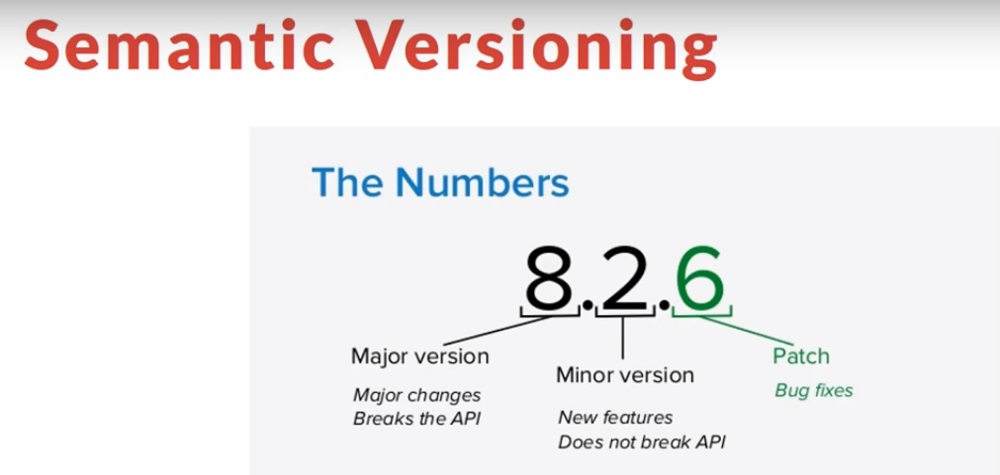

# NPM vs Yarn

## Semantic Versioning



## Accessing the list of commands

```bash
> npm help # npm -h

> yarn help # yarn -h
```

## Starting a new project

```bash
> npm init
> npm init -y # default setup

> yarn init
> yarn init -y # default setup
```

## Installing all the dependencies

```bash
> npm i # or npm install

> yarn # or yarn install
```

## Adding a dependency

```bash
> npm i [package] # yarn add lodash
> npm i [package]@[version] # yarn add lodash@4.17.21
> npm i [package]@[tag]

> yarn add [package] # yarn add lodash
> yarn add [package]@[version] # yarn add lodash@4.17.21
> yarn add [package]@[tag]
```

## Adding a dependency globally

```bash
> npm i -g [package]

> yarn add -g [package]
```

## Adding a dependency to different categories of dependencies

- **dependencies**: Packages required in production. Example: lodash
- **devDependencies**: Packages only needed for local development and testing. Example: grunt

```bash
> npm i -D [package] # or npm i --dev [package]
> npm add [package] --peer

> yarn add [package] --dev # or yarn add -D [package]
> yarn add [package] --peer
```

## Upgrading a dependency

```bash
> npm update [package]
> npm update [package]@[version]
> npm update [package]@[tag]

> yarn up [package]
> yarn up [package]@[version]
> yarn up [package]@[tag]
```

## Removing a dependency

```bash
> npm uninstall [package]

> yarn remove [package]
```

## Upgrading npm and yarn

```bash
> npm install -g npm@latest

> yarn set version latest
> yarn set version from sources
```
